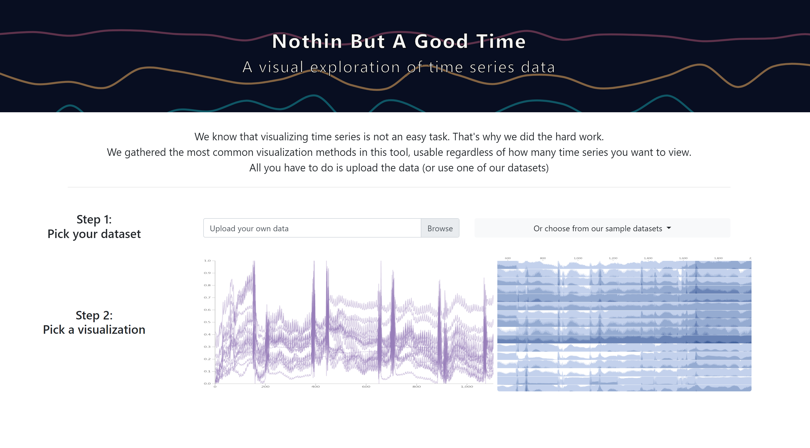
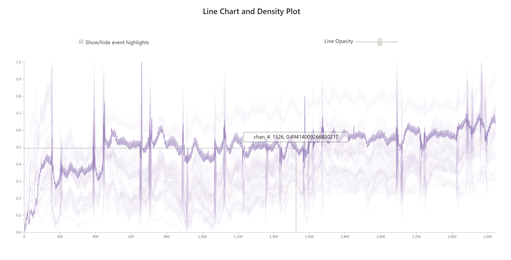
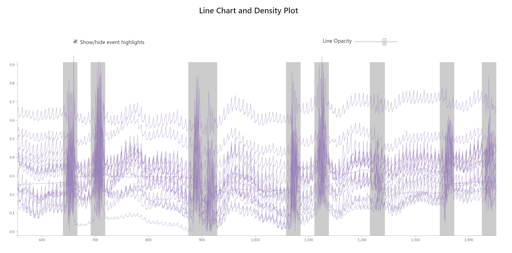
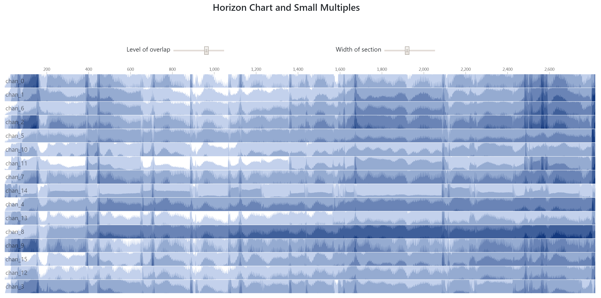
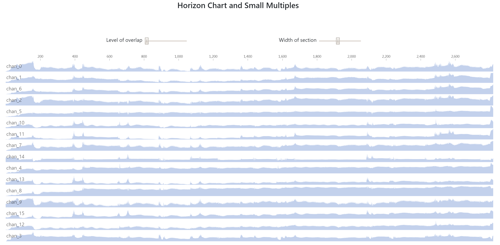

# Nothin-But-A-Good-Time

A tool for
visualizing and exploring arbitrary time 
series datasets without having to design
and code a custom visualization. It can also
be used as a preliminary tool to determine
what design choices would be good for a
data-specific time series visualization.

The final tool can be found 
[here.](https://pslessard.github.io/final/home.html)
A demo video can be located [here.](https://drive.google.com/open?id=1CSdnNPC39k38fWJCafp9Tp49e72xnU7Os)

The interface should all be self-explanatory
with the exception of the feature for 
uploading your own data. The data must be
 csv file with the following format:
```
id,time,value,event
string,float,float,(1 or 0)
...
``` 

No libraries (besides d3 and Bootstrap)
were used in creating this visualization
tool. All of the coding was done by hand
using some examples as reference points.

We were inspired by the papers below to implement parts of our visualizations:
[Fast Visualization for Large Time Series](https://www.ncbi.nlm.nih.gov/pmc/articles/PMC3986407/)
[Dense Line Chart: Visualizing a Million Time Series](https://idl.cs.washington.edu/files/2018-DenseLines-arXiv.pdf)


## Images of the site

### Front Page


### Dense Lines Chart


### Zoomed Dense Lines Chart with Events


### Horizon Graph


### Small Multiples Chart (Horizon with no overlap)

